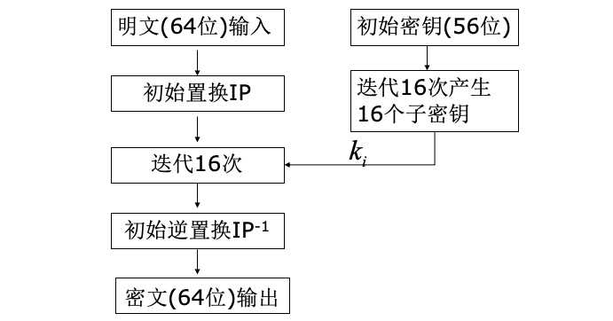
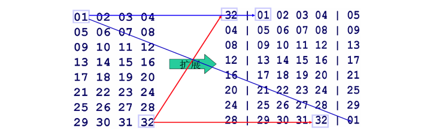
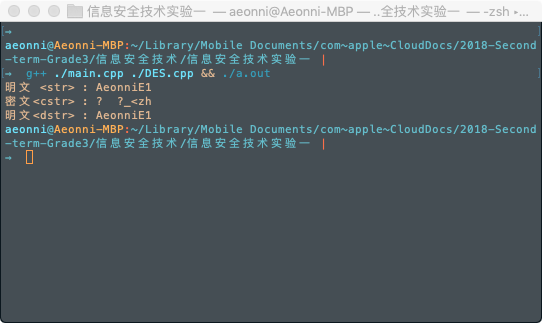
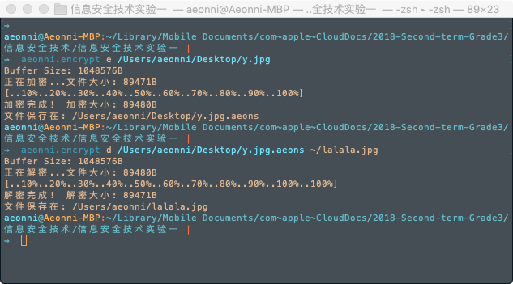
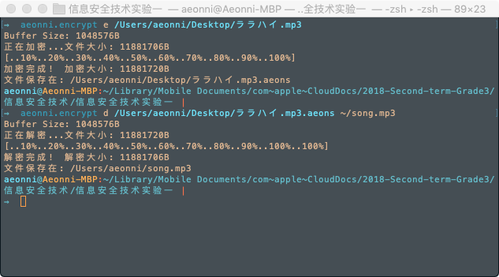
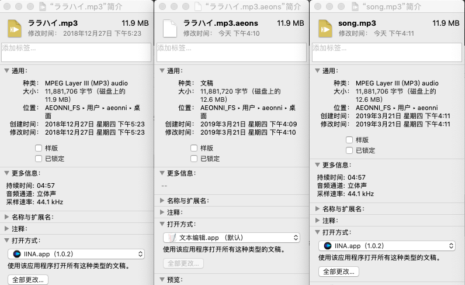

# 信息安全技术实验报告 实验一

### 16061334 --- 张** --- 2019.03.22

----

## 一、实验目的

理解、掌握 DES 分组密码算法流程。

## 二、实验内容

1. 阅读、分析DES分组密码源程序。
2. 调用DES分组密码源程序中的相关函数，完成8字节的明文加密成8字节的密文，并完成解密。
3. 调用DES分组密码源程序中的相关函数，设计一个文件加密器，可以加密任意长度的文件，并密文文件可解密还原回原明文文件。
   
## 三、DES分组密码算法流程

### DES 加密算法

DES 算法加密的流程如下:

1. 对于每64位的输入数据, DES 算法先用置换IP打乱原有的排列次序.
2. 对于56位初始密钥经过一系列的处理得到16个子密钥.
   1. PC-1置换、循环左移、置换选择
   2. 每一次操作输出一组48位的子密钥
3. 处理置换后的原始输入:
   1. 输入被分为左右两组
   2. 前一次迭代时的右侧会成为后一次迭代的左侧,
   3. 前一次迭代时的右侧在与当次的子密钥进行某种运算 `F(R,K)` 后与前一次的左侧做异或运算,作为后一次的右侧.
   4. 一共迭代16次
4. 对迭代后的数据用 $IP$ 矩阵的逆矩阵 $IP^{-1}$ 逆置换, 得到输出的密文.

- F(R,K) 的算法:
  1. 对 R 进行扩展置换, 将32位R扩展为48位, 如下图所示.
   
  2. 把扩展后的48位输出 $E(R_i)$ 与压缩后的48位密钥 $K_i$ 做异或运算.
  3. S盒替代, 将异或得到的48位结果分成八个6位的块，每一块通过对应的一个S盒产生一个4位的输出.（共8个4x16的S盒）
  4. P置换, 将变换后得到的32位结果重新排列,其即为迭代函数的输出.

### DES 解密算法

DES的解密算法和加密算法完全相同，只是各子密钥的使用顺序相反，即为$k_{16},k_{15},k_{14},…,k_2,k_1$。

## 四、实验过程

- ### 8字节的明文加解密:
  1. 阅读 `DES.cpp` 发现函数 `DES_EncryptBlock()` 和 `DES_DecryptBlock()` 就实现了8字节的明文块加解密的功能.
  2. 随机生成一个64位的密钥序列,我懒得自己打就直接拿Python随机生成了一个.
  3. 按照 DES 的算法流程, 调用 `DES_MakeSubKeys()` 函数生成子密钥.
  4. 按照加解密函数需要的参数编写程序. 输出结果打印在终端.
  5. 代码在附件中, 效果图在 `五、实验结果`
   
- ### 文件加密器加解密:
  1. 工作方式选择 **“电⼦子密码本ECB”**
  2. 对于所有的文件,使用二进制方式读取,每读取8位就进行一次加密,加密的流程与`8字节的明文加解密` 相同.
  3. 对于文件大小不是8的整数倍的文件, 在末尾用 -1 填充.
  4. 在加密后的文件中需要保留原文件的大小信息, 因为对于文本文件来说, 文件中不会出现小于0的字节, 所以可以用解密得到的文件中含有 -1 来识别文件末尾. 但是对于二进制文件, 特别是音频文件来说, 就无法这么判断.
  5. 我将原文件的大小信息保存在加密文件的前8字节, 其实保留的只是最后 -1 的个数 `(8 - (size mod 8))` 那么为什么要占用前8字节呢? 因为我把这个数值保存了8次, 这样加密的文件就是8的整数倍了（强迫症...）
  6. 解密的时候就是先读取之前保留的数值,计算原文件的大小,然后解密文件.
  7. 我在实现的时候为了减少磁盘写入操作的次数, 使用了一个缓冲区（大小用宏定义, 必须是8的整数倍）当缓冲区满了才进行一次磁盘写入操作. （虽然似乎没什么用...）
  8. 结果就是可以很好的加解密任意文件, 但是效率其实比较低, 11.9M 的音频文件加密要花去20多秒. 
  9. 代码在附件中, 效果图在 `五、实验结果`

## 五、实验结果

- ### 8字节的明文加解密效果:
   - 代码文件 `main_d8.cpp`
   - 效果:
   - 

- ### 文件加密器加解密效果:
  - 代码文件 `main.cpp`
  - 加解密图片:
  - 
  - 加解密音频:
  - 
  - 音频文件对比:
  - 
