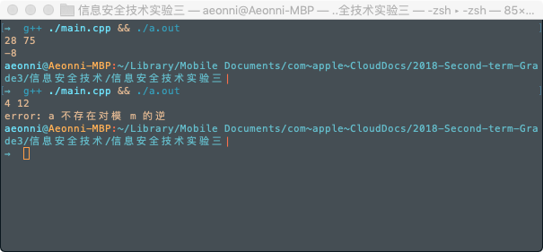

# 信息安全技术实验报告 实验三

### 16061334 --- 张** --- 2019.04.18

----

## 一、实验目的

理解、掌握求模逆算法的基本过程。

## 二、实验内容

1. 熟悉扩展欧几里德算法。
2. 利用扩展欧几里德算法求模逆，要求：任意输入两个整数 $a, m$；输出 $a^{-1} \mod m$;当模逆不存在时，输出出错提示。

## 三、求模逆算法基本原理 

### 1. 扩展欧几里德算法迭代过程：

输入：两个非负整数 $a, b, a≥b$

输出：$d=\gcd (a, b)$, $x$ 和 $y$ 满足 $ax+by=ad$

`Step1` $s \leftarrow 1$, $u \leftarrow 0, t \leftarrow 0, v \leftarrow 1$

`Step2` $q \leftarrow a/b$, $r \leftarrow a\mod b$

`Step3` if $r=0$, $d \leftarrow b, x\leftarrow u, y \leftarrow v$，end

`Step4` 
   - $a\leftarrow b, b\leftarrow r$
   - $tmp\leftarrow u, u\leftarrow s -u*q, s\leftarrow tmp$ 
   - $tmp\leftarrow v, v\leftarrow t -v*q, t\leftarrow tmp$ 

`Step5` to `Step2`

### 2. 求模逆算法：

$(a,m) = 1 \Rightarrow ap+mq = 1$

$ap+mq \equiv 1(\mod m)$

$ap \equiv 1(\mod m)$

$\therefore$ $p$ 是 $a$ 对模 $m$ 的逆， $a^{-1} \mod m = p$

可以直接用上述的扩展欧几里得算法求得。

## 四、实验过程

#### 扩展欧几里得算法求最大公约数以及 U, V 的实现：
- 使用递归；
- 算法中的 u, v 从外部以引用的方式传入；
- 算法中的 s, t 由函数自己维护；
- 返回值为最大公约数。

``` C++
int ex_gcd(int a, int b, int& u, int& v, int s = 1, int t = 0) {
    int q = a / b;
    int r = a % b;
    if(r) { 
        int tmp = u;
        u = s - u * q;
        s = tmp;

        tmp = v;
        v = t - v * q;
        t = tmp;

        return ex_gcd(b, r, u, v, s, t);
    }return b;
}
```

#### 求模逆算法实现：
- 调用上述的 `ex_gcd()` 函数；
- 如果 `(a, m)` 不等于 1，也就是说不存在模逆的时候，throw 一行错误信息。

``` C++
int mod_reverse(int a, int m) {
    int u = 0, v = 1;
    int g = ex_gcd(a, m, u, v);
    if( g != 1 ){
        throw "a 不存在对模 m 的逆";
    }
    return u;
}
```

#### 主函数
- 主函数就简单的做一些输入输出；
- 当 a 不存在对模 m 的逆时可以 catch 一下 error。

``` C++
int main() {
    int a, m;
    cin >> a >> m;
    try
    {
        cout << mod_reverse(a,m) << endl;
    }
    catch (const char *e)
    {
        cerr << "error: " << e << endl;
        exit(1);
    }    
    return 0;
}
``` 

## 五、实验结果

- ### 效果如下图:
- 

