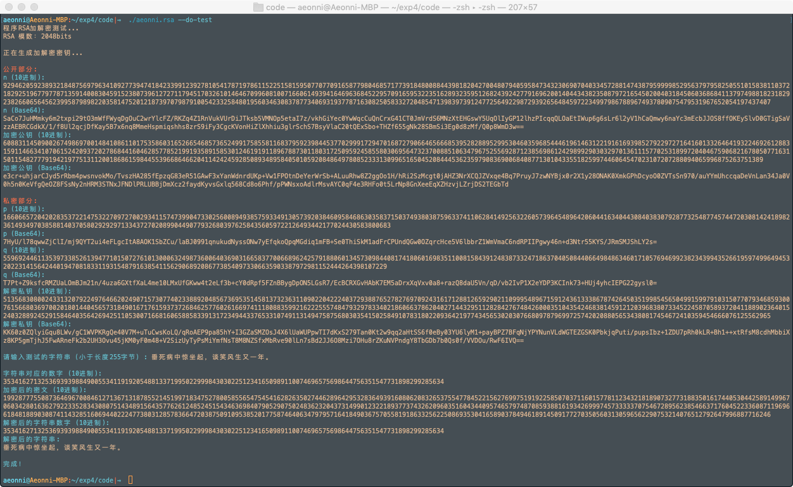

<script type="text/javascript" src="http://cdn.mathjax.org/mathjax/latest/MathJax.js?config=TeX-AMS-MML_HTMLorMML"></script>

<script type="text/x-mathjax-config">
MathJax.Hub.Config({
tex2jax: {inlineMath: [['$','$'], ['\(','\)']]}
});
</script>


# 信息安全技术实验报告 实验四

### 16061334 --- 张子扬 --- 2019.04.28

----

## 一、实验目的

理解、掌握RAS公钥加密算法的基本过程。

## 二、实验内容

1. 熟悉 MPIR 大整数运算库函数的调用。
2. 利用 MPIR 大整数运算库函数，实现 RSA 公钥加密算法。要求:
   1. RSA 模数为 2048bit；
   2. 能对一个数据（例如，16进制数“1234567890ABCDEF”）进行加密、解密。

## 三、实验环境
- OS： MacOS 10.14
- 编译环境： GCC
- MPIR 版本： 2.7.0

## 四、RSA 公钥加密算法基本原理 

### 1. 密钥生成算法：
1. 随机生成两个不同大素数 $p, q$
2. 计算 $n=pq,$  $\phi(n)=(p-1)(q-1)$
3. 随机选取整数 $e$, $1<e<\phi(n)$ ,满足 $(e,\phi(n))=1$;
4. 利用扩展欧基里德算法求出满足 $ed=1 \mod(\phi(n))$ 的整数 $d$;
5. 公开 $(n,e)$ ，保密 $(p,q,\phi(n),d)$ 。其中 $e$ 就是加密密钥，而 $d$ 就是解密密钥，$n$ 称为模数。

### 2. 加解密算法
- 加密： $c=E_e(m)=m^e \mod n$
- 解密： $m=E_d(c)=c^d \mod n$

### 3. 安全性

RSA 的安全性是基于大整数的因子分解的困难性


## 五、实验过程

### ⚠️ *在 MacOS 下使用 MPIR 库的方式*：

从 GitHub 下载 `2.7.0` 版本的 `MPIR` 库：

[https://github.com/wbhart/mpir](https://github.com/wbhart/mpir)

`2.6.0` 版本编译会有问题， `3.0.0` 没有尝试过，因为有人发过 issue。

进入代码所在文件夹后运行以下命令就可以成功编译安装了。

```bash
./configure --enable-gmpcompa
make
make check #: check mpir library
sudo make install
```

使用这个库时，需要在代码中加入以下两个头文件：

```C++
#include "mpir.h"
#include "gmp.h"
```

并使用 `-lmpir` 参数进行编译:

```bash
g++ ./main.cpp -lmpir
```

### 文件组织
我猜下次上机的题目是做一个 RSA 加密的文件加密器？

所以提前组织一下代码，避免太乱：

`根目录` 下是一些自己写的代码：
- `main` 主函数
- `rsa` 加密相关函数
- `encoding` 一些有关于格式转换的代码

`libs` 文件夹下是一些网上找的，用来方便交互的代码：
- `base64` base64 加解密代码，(大数用字符串显示比较方便看)
- `cmdline` 命令行参数解释器

### 程序编写

按照 RSA 算法的步骤调用 MPIR 库中的函数， 感觉还是比较容易的，下面贴几个中文版说明中没给出的函数：

- `mpz_import` 、`mpz_export` 可用于将字符串转换成大数字、将大数字转换成字符串。
  
- `mpz_out_raw` 、`mpz_input_raw` 可用于将大数保存到文件、将保存的文件读取回来。

程序中默认的 RSA 模数按照实验要求设置为了 2048bit，为了好玩，我加了一个用以调节模数的命令行参数，可通过命令行参数 `--bits` 将模数设置为其它值，为了规范起见，我把其取值限制在了（256, 512, 1024, 2048, 4096）的范围中。

### 编译、运行程序

```bash
# 编译代码
g++ ./main.cpp ./rsa.cpp ./libs/base64.cpp ./encoding.cpp -lmpir -o aeonni.rsa
# 运行一个测试函数
aeonni.rsa --do-test
```

## 六、实验结果

