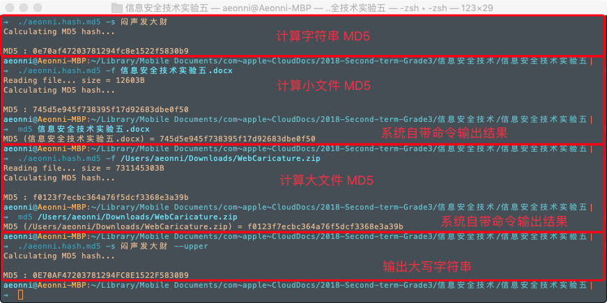

<script type="text/javascript" src="http://cdn.mathjax.org/mathjax/latest/MathJax.js?config=TeX-AMS-MML_HTMLorMML"></script>

<script type="text/x-mathjax-config">
MathJax.Hub.Config({
tex2jax: {inlineMath: [['$','$']]}
});
</script>


# 信息安全技术实验报告 实验五

### 16061334 --- 张子扬 --- 2019.05.17

----

## 一、实验目的

理解、掌握 MD5 散列算法的基本过程

## 二、实验内容

1. 理解 MD5 散列算法的基本过程。
2. 分析阅读 MD5 源代码
3. 调用 MD5 源代码，能对任意文件计算出文件的散列值。

## 三、MD5散列算法基本原理 

1. 附加填充位

    对消息进行数据填充，使消息的长度对512取模得448，设消息长度为X，即满足 `X mod 512=448`。根据此公式得出需要填充的数据长度。

    填充方法：在消息后面进行填充，填充第一位为1，其余为0。

2. 附加长度

    在第一步结果之后再填充上原消息的长度，可用来进行的存储长度为64位。如果消息长度大于264，则只使用其低64位的值，即（消息长度 对 264取模）。

    在此步骤进行完毕后，最终消息长度就是512的整数倍。

3. 数据处理 ( 初始化MD缓冲区/按512位的分组处理 ) + 输出

    准备需要用到的数据：

   - 4个常数： A = 0x67452301, B = 0x0EFCDAB89, C = 0x98BADCFE, D = 0x10325476, 这些常数在 `md5_init()` 函数中被初始化：
        ```C
        md5_init(md5_state_t *pms)
        {
            pms->count[0] = pms->count[1] = 0;
            pms->abcd[0] = 0x67452301;
            pms->abcd[1] = 0xefcdab89;
            pms->abcd[2] = 0x98badcfe;
            pms->abcd[3] = 0x10325476;
        }
        ```
   - 4个函数，这些函数在 `md5_process()` 中被实现：
     - $F(X,Y,Z) = (X \& Y) | ( ( \sim X) \& Z )$ ; 
     - $G(X,Y,Z) = (X \& Z) | ( Y \& ( \sim Z ) )$;  
     - $H(X,Y,Z)=X \oplus Y \oplus Z$; 
     - $I(X,Y,Z)=Y \oplus (X | ( \sim Z))$;
  
    把消息分以512位为一分组进行处理，每一个分组进行4轮变换，以上面所说4个常数为起始变量进行计算，重新输出4个变量，以这4个变量再进行下一分组的运算，如果已经是最后一个分组，则这4个变量为最后的结果，即MD5值。

## 四、实验过程

1. 先尝试编写了计算字符串 MD5 散列值的代码以做测试。
2. 参数解析继续使用 `cmdline` 命令行参数解释器（真香） [github.com/tanakh/cmdline](https://github.com/tanakh/cmdline)
3. 参数的设定是 `-s` 字符串， `-f` 文件路径， `--upper` 输出大写结果
4. 计算散列值的步骤如下（字符串和文件并没有什么区别）：

    ````C
    md5_init(&md5_state);
    md5_append(&md5_state, 
            (const md5_byte_t*)data, 
            length);
    md5_finish(&md5_state, result);
    ````
5. 对于文件来说就只是多了一步读取的步骤，我在这里一口气读取了整个文件，没有去尝试并行计算，计算时间会随文件增大而明显增加，且可计算的最大文件受到内存大小限制。

## 五、实验结果

MD5 散列计算结果无误，和系统自带的命令相比，速度慢了一点。

- ### 效果如下图:
- 

