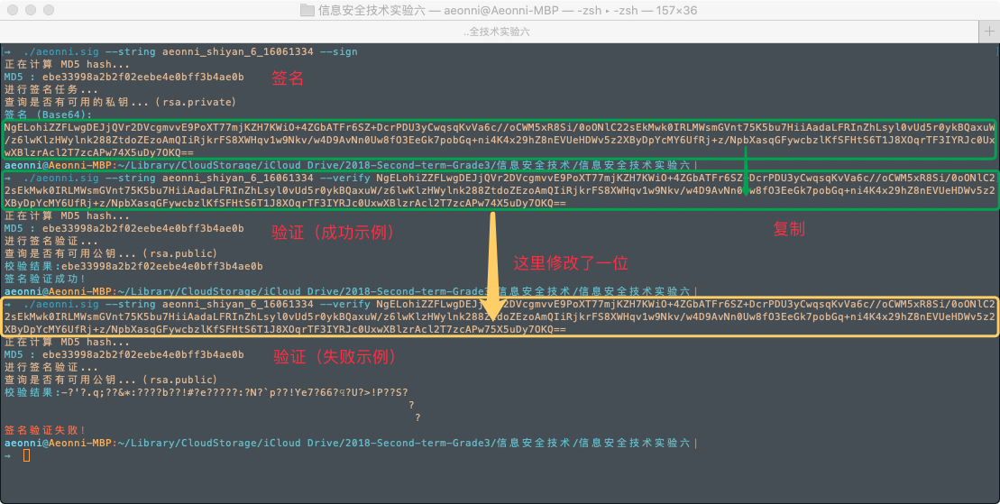
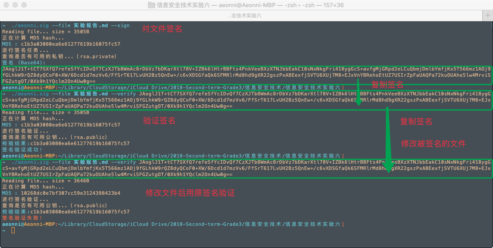

# 信息安全技术实验报告 实验六

### 16061334 --- 张** --- 2019.06.09

----

## 一、实验目的

理解、掌握RAS数字签名算法的基本过程。

## 二、实验内容

1. 熟悉MPIR大整数运算库函数的调用。
2. 熟悉MD5散列的调用。
3. 利用MPIR大整数运算库函数，实现RSA数字算法。要求:
    1. RSA模数为2048bit；
    2. 能对任意文件进行签名、验证（调用MD5散列函数求文件的散列值，再对散列值进行签名）。


## 三、实验环境
- OS： MacOS 10.14
- 编译环境： GCC
- MPIR 版本： 2.7.0

## 四、RSA数字签名算法基本原理

### 1. RSA 密钥生成算法：
1. 随机生成两个不同大素数 $p, q$
2. 计算 $n=pq,$  $\phi(n)=(p-1)(q-1)$
3. 随机选取整数 $e$, $1<e<\phi(n)$ ,满足 $(e,\phi(n))=1$;
4. 利用扩展欧基里德算法求出满足 $ed=1 \mod(\phi(n))$ 的整数 $d$;
5. 公开 $(n,e)$ ，保密 $(p,q,\phi(n),d)$ 。其中 $e$ 就是加密密钥，而 $d$ 就是解密密钥，$n$ 称为模数。

### 2. 签名/验证算法：

- 使用 Hash 函数 $H(x)$ 来阻止存在性伪造
- 签名算法：对于消息 $M$，计算 $m＝H(M)$
  - 签名： $S=m^d \mod n$

- 验证签名：消息 $M$ 及其签名 $S$，计算m＝H(M)
  - 验证： $m'=S^e \mod n$
  - 如果 $m＝m’$ 则 $S$ 是 $M$ 的签名，否则 $S$ 是伪造签名


## 五、实验过程

1. 主要是对`实验四`和`实验五`的代码做一个整合（MPIR 库的安装不再赘述）。
2. 为了保存产生的密钥文件，所以引入了 `jsoncpp` 库。
3. 参数解析继续使用 `cmdline` 命令行参数解释器（真香） [github.com/tanakh/cmdline](https://github.com/tanakh/cmdline)
4. 参数设置结果如下：
    ```bash
    $ ./aeonni.sig --help   
    usage: aeonni.sig [options] ... 
    options:
    -s, --sign        （任务）进行签名
    -v, --verify      （任务）进行验证 (string [=])
        --rsa-test    （任务）RSA 加密功能测试
    -f, --file        输入一个文件路径 (string [=])
        --string      输入一个字符串 (string [=])
    -k, --key-file    输入一个密钥文件路径 (string [=])
    -b, --bits        RSA 模数 (int [=2048])
        --help        Print this message
    ```

5. 使用 Json + Base64 格式保存/加载密钥文件，并命名为：
   - `rsa.private`
   - `rsa.public`
   - 如果有这两个文件则读取使用，没有则随机生成。

6. 本程序可以对字符串或者任意文件进行 rsa 签名。 为了校验的方便，对 MD5 进行签名的时候是对其16进制字符串进行签名而不是二进制序列。

7. 编译程序：

    ```bash
    g++ ./main.cpp ./md5.cpp ./rsa.cpp ./encoding.cpp ./libs/base64.cpp ./lib_json/json_reader.cpp ./lib_json/json_value.cpp ./lib_json/json_writer.cpp -o aeonni.sig -lmpir
    ```

8. 详细代码在附件中，对比`实验四`和`实验五`其实就修改整合了一下 `main.cpp` 其余之前写的库文件不做更改。和之前一样，根目录下的代码是全部自己写的，`libs`和`lib_json`中的文件来自互联网。

## 六、实验结果

1. 对字符串进行签名/验证：
   1. 测试签名
   2. 测试验证
   3. 将签名改错一位，测试


1. 对文件进行签名/验证：
   1. 测试签名
   2. 测试验证
   3. 改动文件，测试

